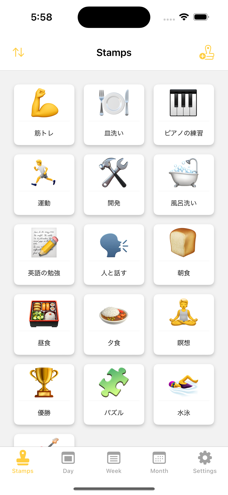
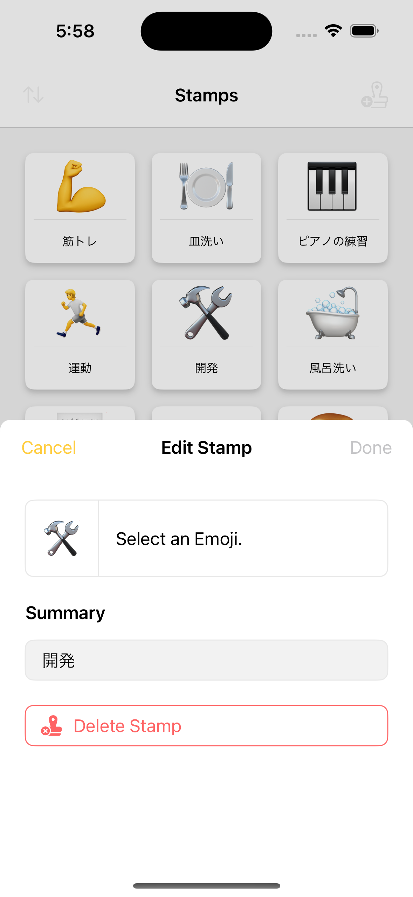
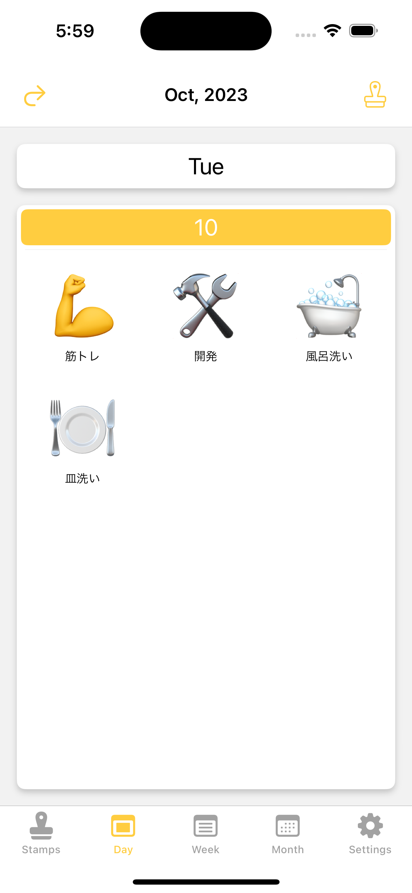
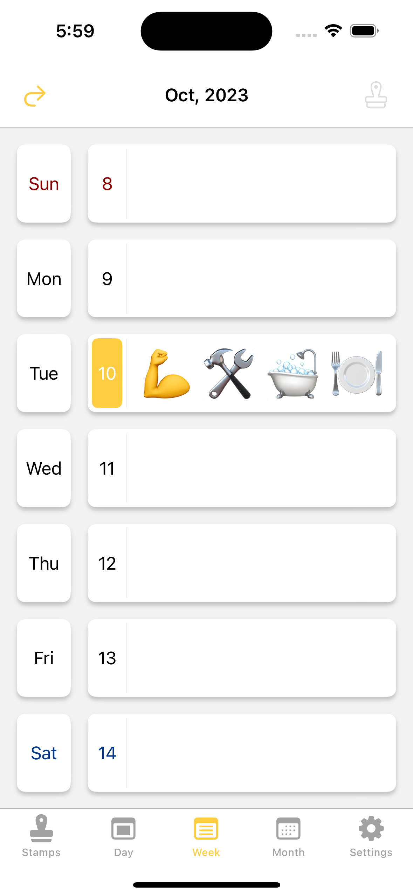
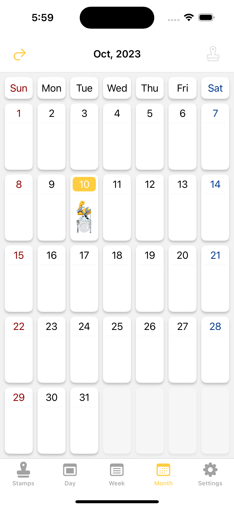

# StampRecord

スタンプで実績を記録をするアプリ

|  |  |  |  |  |
| :----------------------------: | :--------------------------------: | :----------------------------------: | :-----------------------------------: | :------------------------------------: |

## コンセプト

- 日々の努力実績のログを残して可視化できるカレンダー
- 操作は簡単で直感的、アプリを開いて絵文字を選べばログが残せる
- Stamp というのは絵文字のこと
- デザインは Zenn リスペクト、洗練されていて無駄がない

## ターゲットユーザー

- 語学習得、ダイエット、筋トレなど日々の努力を記録に残して励みにしたい人
- お手伝いや勉強の成果を記録して親と確認したい子供
- 薬を服用したかどうかを記録して確認したい人

## 動作環境/実装環境

- iOS/iPadOS 16.4+
- macOS 13+
- Xcode 15.0+
- Swift 5+
- Full SwiftUI（UIKit を使わない）

## 機能

- スタンプ一覧
  - [x] 新規スタンプ登録
  - [x] スタンプ編集（削除）
  - [ ] スタンプ別実績表示（累計/今月/今週）
- カレンダー表示
  - [x] 日実績
  - [x] 週実績
  - [x] 月実績
  - [x] スタンプ押印
  - [x] スタンプ取り消し
- SNS への実績の共有
- 設定
  - [x] 週の始まり（日曜/月曜）
  - [x] デフォルトの期間（日/週/月）
  - [ ] データ強制同期
  - アプリの情報
    - ~~ライセンス表示~~
    - [x] バージョン
    - [x] 開発者名
    - [ ] プロダクトページへのリンク
  - [ ] 不具合の報告
- [x] ダークモード対応
- [ ] 多言語対応（日本語/英語）
- [ ] 複数プラットフォーム対応/同期（iOS/iPadOS/macOS）
